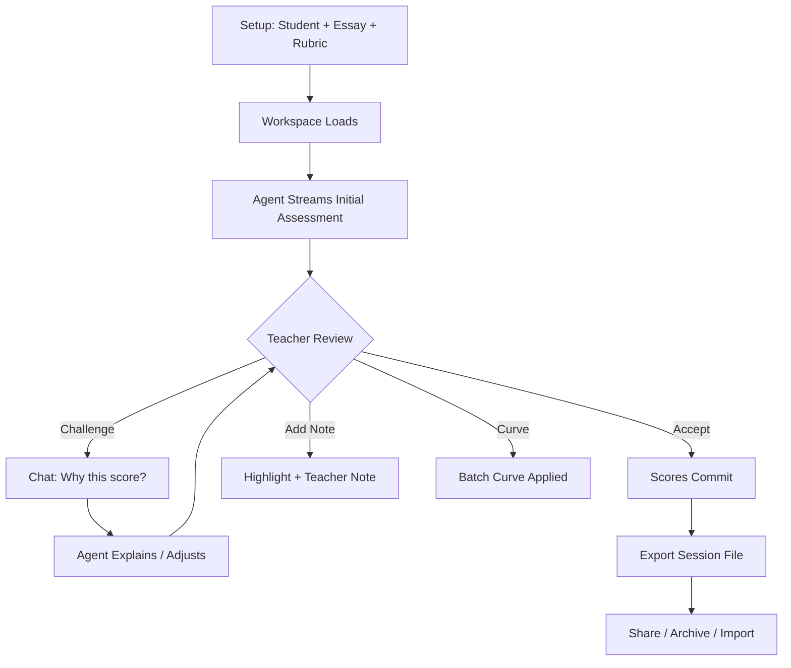

# GraderJet — Project Overview

## Elevator Pitch

**GraderJet** is a human-in-the-loop grading workspace where teachers grade papers alongside an AI agent. The agent performs an initial review; the teacher interrogates its reasoning in a split-screen chat and adjusts scores, feedback flags, and batch curves interactively — all while keeping full pedagogical authority.

> **Core philosophy:** AI proposes, teacher disposes. Every score, highlight, and note is a conversation, not a verdict.

---

## Headline

**GraderJet — The AI Teaching Assistant That Grades With You, Not For You**

---

## Project Overview

### The Problem
Teachers spend 10–15 hours per week grading. Existing tools either:
- **Fully automate** (black-box scores, no pedagogical transparency)
- **Digitize paper** (PDF annotators with no intelligence)

Neither respects the teacher's expertise or the nuance of student writing.

### The Solution
GraderJet creates a **collaborative grading loop**:
1. **Agent reviews** — streams an initial assessment with cited evidence
2. **Teacher interrogates** — chat dialogue to challenge, refine, or override any claim
3. **Live workspace** — scores, highlights, and notes update in real time via tool calls
4. **Export & share** — session files capture the entire grading journey for moderation, calibration, or co-teaching

### Key Differentiators
| Traditional | GraderJet |
|-------------|-----------|
| Black-box rubric scores | **Transparent reasoning** — every deduction cites a passage |
| Static rubrics | **Dynamic curves & custom rubrics** — batch adjustments in one click |
| Solo grading | **Shareable sessions** — calibrate with colleagues, import/export |
| Post-hoc feedback | **In-process dialogue** — feedback co-written with the agent |

---

## Video Script (90-Second Demo)

### Scene 1: The Hook (0–10s)
> **[Screen: Teacher opens GraderJet, sees clean landing page]**
> 
> **Narrator:** "What if your grading assistant showed its work — and let you argue with it?"

### Scene 2: Setup (10–25s)
> **[Screen: Setup page — drag & drop a .docx, paste a rubric, or load sample]**
> 
> **Narrator:** "Drop in a student essay. Paste your school's rubric. Or try the built-in demo."

### Scene 3: The Agent Starts (25–45s)
> **[Screen: Workspace loads — left panel document, right panel Agent Dialogue + Scorecard]**
> 
> **Agent (streaming):** "Thesis: 14/20 — claim is present but underspecified. Evidence: 12/20 — two citations, both from the same source."
> 
> **[Scores appear on Scorecard. Passages highlight in document.]**
> 
> **Narrator:** "The agent grades live. Every score cites the text. You see exactly why."

### Scene 4: Human-in-the-Loop (45–70s)
> **[Screen: Teacher types in chat: "Thesis is actually stronger — raise to 18 and explain"]**
> 
> **Agent:** "Updated. Thesis now 18/20 — the claim previews the argument structure in paragraph 2."
> 
> **[Score updates. Teacher adds a paragraph note: "Great transition here."]**
> 
> **Narrator:** "You don't just accept — you converse. Challenge. Refine. The agent learns your standard."

### Scene 5: Batch & Curves (70–80s)
> **[Screen: Multiple papers in batch. Teacher clicks "Apply curve +3 — class struggled with evidence."]**
> 
> **Narrator:** "One click curves the whole class. Reasoning logged for transparency."

### Scene 6: Export & Share (80–90s)
> **[Screen: Export dialog — "Download session file" → colleague opens it on their machine]**
> 
> **Narrator:** "Share the full session — grades, notes, chat, curve — as one file. Calibration meetings just got real."
> 
> **[Logo + tagline]**
> 
> **GraderJet — Grade With Confidence.**

---

## Tools & Technologies (25 Max)

| Category | Tools |
|----------|-------|
| **Framework** | Next.js 14 (App Router), React 18, TypeScript |
| **Styling** | Tailwind CSS, shadcn/ui, Radix UI primitives |
| **AI/Chat** | Vercel AI SDK v7, `@ai-sdk/react`, `@ai-sdk/openai`, `@openrouter/ai-sdk-provider` |
| **State** | React hooks, localStorage persistence, custom undo/redo stack |
| **File Processing** | `mammoth` (.docx), `pdfjs-dist` (PDF), custom text extraction |
| **Testing** | Node `--test` (unit), Playwright (E2E), 84 unit tests |
| **CI/CD** | GitHub Actions (typecheck + test + build), Vercel (deploy) |
| **Observability** | Nightly smoke test vs production (real model), structured logging |
| **Validation** | Zod v4 (runtime), strict TypeScript config |
| **DevEx** | ESLint, Prettier, Husky (pre-commit), opencode CLI |

---

## Documentation

### Architecture

```
app/
  api/chat/route.ts       # Streaming agent endpoint (real model + mock fallback)
  page.tsx                # Landing page
  setup/page.tsx          # Student/essay/rubric entry → session
  workspace/page.tsx      # Grading workspace (loads session + persisted state)

components/
  top-nav.tsx             # Paper navigator, class selector, export dialog
  document-viewer.tsx     # Paragraph-level highlights, teacher notes
  workbench.tsx           # Agent Dialogue + Scorecard tabs + activity feed
  scorecard.tsx           # Live rubric scores, letter grade, batch curve
  agent-dialogue.tsx      # Streaming chat with tool-call cards
  activity-feed.tsx       # Chronological audit trail
  rubric-editor.tsx       # Custom rubric builder on setup page

hooks/
  use-grading-workspace.ts  # Core state: submissions, scores, highlights, notes, chat
  use-keyboard-shortcuts.ts # Power-user shortcuts (undo/redo, next paper, export)

lib/
  session.ts              # GradingSession store (localStorage) + submission builder
  session-export.ts       # Shareable session file: serialize/parse/validate
  agent/
    tools.ts              # update_scores, highlight_passage, apply_batch_curve
    prompt.ts             # System prompt builder (deduped, tested)
    api-key.ts            # Fail-loud key validation (OpenRouter/OpenAI)
    chat-input.ts         # UI-message validation (clear 400 on bad payload)
    mock-model.ts         # Deterministic offline agent for dev/test
  grading.ts              # Score math, letter grades, curve application
  types.ts                # Shared TypeScript interfaces
  mock-data.ts            # Built-in rubric + demo submissions
```

### Data Model

```typescript
// Core session (stored in localStorage as graderjet.session.v1)
interface GradingSession {
  id: string;
  studentName: string;
  title: string;
  prompt: string;
  text: string;                    // Full essay (paragraphs split on blank lines)
  rubricId: string;
  createdAt: number;
  sampleId?: "alex-rivera" | "priya-patel";
  batch?: BatchEntry[];            // Multi-student grading
  customRubric?: Rubric;           // Teacher-edited rubric
}

// Workspace state (persisted as graderjet.workspace.v1.<sessionId>)
interface WorkspaceState {
  submissions: Submission[];       // Scores, highlights, notes per paper
  batchCurve: number;              // Whole-class adjustment
  messages: UIMessage[];           // Full agent conversation
}

// Shareable export (downloaded as .json)
interface SessionExport {
  app: "GraderJet";
  version: 1;
  exportedAt: string;              // ISO timestamp
  session: GradingSession;
  workspace?: WorkspaceState;      // Optional — fresh setup if absent
}
```

### Agent Tools

| Tool | Parameters | Effect |
|------|------------|--------|
| `update_scores` | `category`, `new_score`, `reasoning` | Mutates Scorecard live |
| `highlight_passage` | `start_line`, `end_line`, `reason` | Flags text in Document Viewer |
| `apply_batch_curve` | `points`, `reason` | Shifts grading scale for batch |

---

## Extended Features (Roadmap)

### 1. Test & Quiz Grading
- **Objective items** — auto-score multiple choice, true/false, matching
- **Short answer** — semantic similarity + keyword rubrics with teacher override
- **Coding exercises** — run tests in sandbox, agent reviews logic/style
- **Rubric pasting** — paste any rubric (text/markdown/CSV) → instant structured editor

### 2. Digital Assignments & Multimedia
| Format | Support |
|--------|---------|
| **Documents** | .docx, .pdf, .txt, Google Docs import |
| **Videos** | Timestamped comments, transcript grading, rubric per segment |
| **Designs** | Image upload (Figma, PNG, PDF) → visual rubric (composition, hierarchy, accessibility) |
| **Code** | GitHub Classroom sync, PR-based review, test-suite integration |
| **Audio** | Podcast/presentation grading with transcript + timestamped feedback |

### 3. Grading System Integrations
| System | Status |
|--------|--------|
| **Standards-based** | ✅ Rubric maps to standards (CCSS, NGSS, state) |
| **Competency/mastery** | ✅ Evidence tags → mastery dashboard |
| **Contract grading** | ✅ Contract terms as rubric categories |
| **Specifications grading** | ✅ Pass/fail bundles with revision loops |
| **Custom school systems** | 🔧 **Pluggable adapter** — JSON schema for gradebook export (Canvas, PowerSchool, Schoology, custom) |

### 4. Collaboration & Calibration
- **Co-grading** — two teachers on one session (real-time cursors, conflict resolution)
- **Blind calibration** — anonymized papers, compare scores, compute inter-rater reliability
- **Moderation workflow** — department chair reviews sample, approves/releases

### 5. Feedback & Communication
- **Feedback library** — reusable comments with variables (`{student}`, `{score}`)
- **Student-facing view** — shareable read-only link (scores + comments + highlights)
- **Parent/guardian portal** — optional, FERPA-compliant summary
- **Revision cycles** — "Return for revision" button → student resubmits → agent diffs changes

### 6. Analytics & Insights
- **Class heatmap** — which rubric categories need reteaching
- **Student trajectory** — growth over assignments, not just point-in-time
- **Agent alignment** — how often teacher overrides agent (calibration signal)
- **Time-to-grade** — personal & team benchmarks

---

## User Workflow: The Grading Loop



### Immediate User Actions (No Menu Diving)
| Shortcut | Action |
|----------|--------|
| `Ctrl+Enter` | Send chat message |
| `Z` / `Shift+Z` | Undo / Redo |
| `←` / `→` | Previous / Next paper |
| `E` | Open export dialog |
| `N` | New paper (→ setup) |
| `S` | Stop agent stream |
| `1–4` | Jump to rubric category |

---

## Launch Checklist

- [x] Core grading loop (agent ↔ teacher)
- [x] Local persistence (survives refresh)
- [x] Shareable session export/import
- [x] Custom rubric editor
- [x] Batch grading + curves
- [x] Document upload (.docx, .pdf, .txt)
- [x] Unit tests (84) + E2E specs (7)
- [x] CI pipeline (typecheck + test + build)
- [x] Nightly production smoke test
- [x] Vercel deployment + env management
- [ ] OpenRouter free-tier model configured (`gpt-oss-20b:free`)
- [ ] Production verification (real-model smoke)
- [ ] DEPLOYMENT.md updated with free-tier config

---

## Configuration

### Environment Variables (Vercel Production)

| Variable | Value | Notes |
|----------|-------|-------|
| `OPENROUTER_API_KEY` | `sk-or-v1-...` | Free-tier key (set in Vercel dashboard) |
| `OPENROUTER_MODEL` | `openai/gpt-oss-20b:free` | Free variant with tool calling |
| `OPENAI_API_KEY` | *(optional)* | Fallback if OpenRouter unavailable |

### Local Development

```bash
# No API key needed — mock agent works offline
npm install
npm run dev        # http://localhost:3000

# With real model (optional)
cp .env.example .env.local
# Add OPENROUTER_API_KEY=sk-or-...
npm run dev
```

### Verification

```bash
# Unit tests
npm test

# Typecheck
npm run typecheck

# Build
npm run build

# Full UI smoke (mock mode)
PORT=3100 npm start &
node scripts/verify-flow.mjs

# Real-model smoke (requires env vars)
BASE_URL=https://graderjet.vercel.app REAL_MODEL=1 node scripts/verify-flow.mjs
```

---

## License & Attribution

Proprietary — GraderJet © 2026. Built with:
- OpenAI, Anthropic, Google, Meta, NVIDIA, Z.ai models via OpenRouter
- Vercel AI SDK, Next.js, Tailwind, shadcn/ui
- Playwright, Node test runner
- Community open-source libraries (see `package.json`)

---

*Last updated: 2026-08-21 — Commit `7251419` (feat/export-class-summary)*